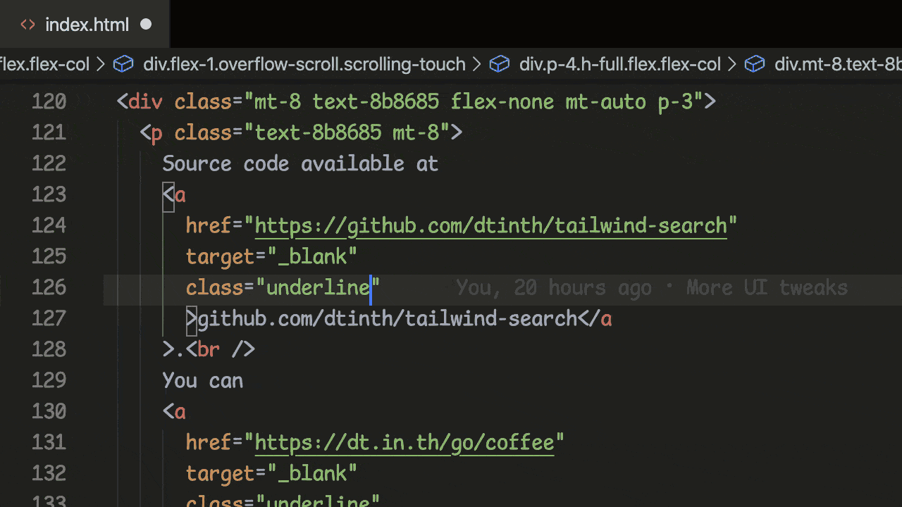

# [@dtinth’s Tailwind CSS Class Search](../..) — VS Code Integration

A [VS Code Power Tools](https://marketplace.visualstudio.com/items?itemName=ego-digital.vscode-powertools) [Command](https://github.com/egodigital/vscode-powertools/wiki/Commands) that lets you search a Tailwind CSS Class by its generated CSS. This integration is experimental and is not officially supported (although pull requests are welcome). Its goal is to demonstrate how the [`@dtinth/tailwind-css-class-search` library](https://unpkg.com/@dtinth/tailwind-css-class-search) can be integrated into a text editor to provide the same functionality as [the webapp](https://tailwind.spacet.me/). Maybe someone can use this to create an actual VS Code extension (left as an exercise for the reader).



## Usage

1. Make sure [VS Code Power Tools](https://marketplace.visualstudio.com/items?itemName=ego-digital.vscode-powertools) is installed.

2. Clone the repository and install dependencies using Yarn.

   ```sh
   git clone https://github.com/dtinth/tailwind-search.git
   cd tailwind-search
   yarn
   ```

3. Add the command in VS Code’s settings.json:

   ```json
   {
     "ego.power-tools": {
       "commands": {
         "dtinth.tailwindSearch": {
           "script": "/<path/to>/tailwind-search/contrib/vscode/command.js"
         }
       }
     }
   }
   ```

4. Go to **Keyboard Shortcuts** and search for `dtinth.tailwindSearch` command, set the desired key.
